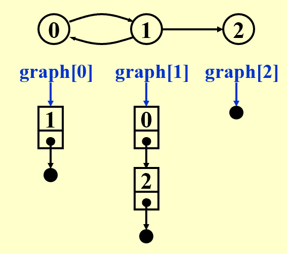
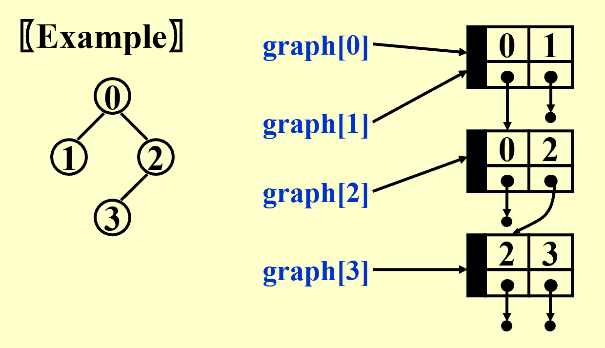
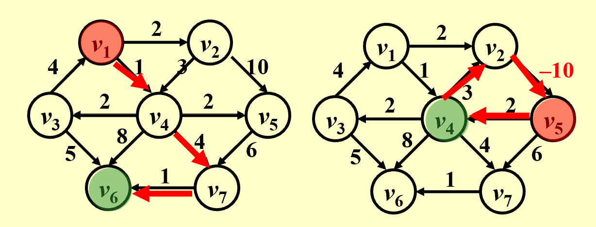
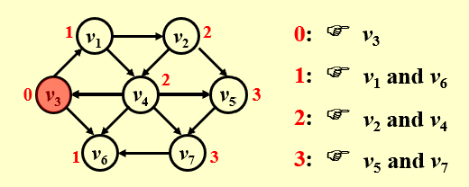
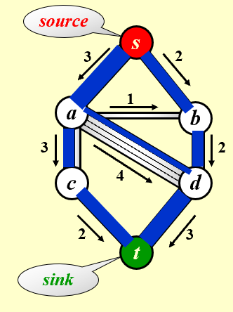
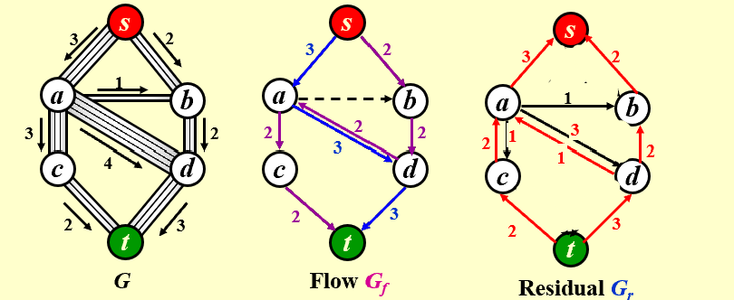
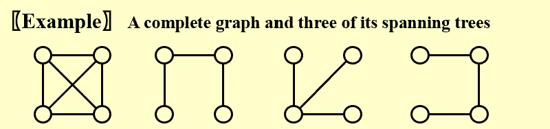

# Graph Algorithms

## 1 定义

### 一些基本概念

- 图由两个集合组成，表示为 $G(V, E)$
    - 点集合 vertices ，表示图中所有的节点
    - 边集合 edges ，表示连接这些节点的线段或指向
    
    !!! warning "约束"
        - 图可以没有边只有点，而不能只有边
        - 不允许边的两端连接同一个点 self loop
        - 不考虑无向图的两个点之间有超过一条边，不考虑有向图的两个点之间有超过两条边

- 无向图 Undirected graph ，边没有方向，仅表示两个节点存在关联 $(v_i, v_j) = (v_j, v_i)$

- 有向图 Directed graph / Digraph ，边有方向，通常用箭头表示 $<v_i, v_j> \ne <v_j, v_i>$


- 完全图 Complete graph ，边的数量达到最大
    - 对于一个有 $n$ 个节点的图，无向图最多有 $\frac{n(n-1)}{2}$ 条边，有向图最多有 $n(n-1)$ 条边

- 子图 Subgraph ，它的点和边都包含在图中

- 路径 Path from $v_p$ to $v_q$ ，从点 $v_p$ 到 $v_q$ 的一个点序列，其中每两个相邻点之间都存在边
    - 路径长度 Length of a path ，一条路径上边的数量 

- 简单路径 Simple path ，路径中的点不重复出现

- 环 Cycle ，路径的第一个点和最后一个点是同一个点，其他点只出现一次

- 连通性 Connectedness 
    - 对于无向图，如果两个点之间有路径，则称这两个点连通 connected ；如果不重复出现的点中，任意两个之间都存在路径，则称这个图连通 connected
    >事实上，一棵树就是一个连通的无环图

- Component of an undirected G

- 有向无环图 A DAG ，directed acyclic graph 

- 强连通图 Strongly connected directed graph G ，对于有向图，任意两个点 $v-i$ 和 $v_j$ 之间，既存在从 $v_i$ 到 $v_j$ 的路径，又存在从 $v_j$ 到 $v-i$ 的路径
    - 如果是任意两个点之间只存在一个方向的路径，那么称为弱连通 weakly connected

- Strongly connected component 

- 度 Degree ，一个点上连接的边的数量
    - 对于有向图，以该点为起点的边的数量称为出度 out-degree ，以该点为终点的边的数量称为入度 in-degree


### 图的表示

#### 邻接矩阵 Adjacency Matrix

对于一个有 $n$ 个点的图，使用一个 $n \times n$ 的二维数组 $A$ 来表示，如果点 $v-i$ 和 $v_j$ 之间有边，则记 $A[i][j] = 1$ ，否则记为 0 。

不难发现，对于无向图 $A$ 是对称的矩阵。

这个方法在图的边很少的情况下，会浪费大量存储空间。

#### 邻接表 Adjacency List

为每个点建立一个单链表，其中所有节点表示从该点出发能到达的点。

??? example "例子"

    


#### 邻接多重表 Adjacency Multilists

在邻接表中，每一条边都会存储两次，现在，邻接多重表把每条边只储存一次，被它连接的两个点共享。

??? example "例子"

    

## 2 拓扑排序 Topological Sort

### 定义

拓扑排序是对图的点集进行线性排序，满足对于任意两点 $i$ 、$j$ ，如果 $i$ 是 $j$ 的前驱，则序列中 $i$ 在 $j$ 之前。

事实上，能够进行拓扑排序的前提是图必须是有向无环图 DAG 。

## 3 最短路径算法 Shortest Path Algorithms

给定：

 - 一个图 $G = (V, E)$ 

 - 成本函数 $c(e) ， e \in E(G)$ 

那么从源点到终点的路径 $P$ 的长度为 $\sum_{e_i \in P} c(e_i)$ 。

### 单源最短路径 Single-Source Shortest-Path Problem

#### 问题描述

给定：

 - 带有权重的图 $G = (V, E)$ 

 - 图中一个确定的源点 $s$ 

找到图中从 $s$ 到其他任何一个点的最短路径。



!!! warning "注意"

    - 如果图中的边有权重为负数，那么不一定存在最短路径，可能会陷入负权环 negative-cost cycle 。
    - 如果图中没有负权环，那么定义从 $s$ 到 $s$ 的最短路径为 0 。

#### 无权的情况 Unweighted Shortest Paths

所有边的权重都为 1 ，最短路径就是经过边数最少的路径。



核心思路是采用广度优先搜索 Breadth-first search（BFS）：

 - 从源点开始，给能到达的相邻点设距离为 1 ；

 - 再从距离为 1 的点出发，给相邻能到达、且未访问过的点距离设为 2 ；

 - 以此类推。

!!! note "算法"

    维护一张表 `T` 来记录每个点的信息，其中：
   
     - `T[i].Dist` 表示从 $s$ 到点 $v_i$ 的距离，
   
     - `T[i].Known` 标记 $v_i$ 是否被访问过，
   
     - `T[i].Path` 记录 $v_i$ 在路径中的上一个点。 
    
    维护一个队列：
   
     - 将源点 $s$ 入队；
   
     - 只要队列不为空，就取出一个点 $v$ ；
        - 遍历 $v$ 的所有邻接点 $w$ ，如果 $w$ 尚未被访问，则修改 $w$ 在表 `T` 中的信息，然后入队。
   
     - 当队列为空时，循环结束。

??? code "代码实现"

    ```c
    void Unweighted( Table T )
    {   /* T is initialized with the source vertex S given */
        Queue  Q;
        Vertex  V, W;
        Q = CreateQueue (NumVertex );  MakeEmpty( Q );
        Enqueue( S, Q ); /* Enqueue the source vertex */
        while ( !IsEmpty( Q ) ) {
            V = Dequeue( Q );
            T[ V ].Known = true; /* not really necessary */
            for ( each W adjacent from V )
        if ( T[ W ].Dist == Infinity ) {
            T[ W ].Dist = T[ V ].Dist + 1;
            T[ W ].Path = V;
            Enqueue( W, Q );
        } /* end-if Dist == Infinity */
        } /* end-while */
        DisposeQueue( Q ); /* free memory */
    }
    ```

    这个方法的时间复杂度为 $O(|V| + |E|)$ 。

#### 有权的情况 Weighted Shortest Paths

采用 Dijkstra 算法（要求边权不为负数），核心是贪心策略，每次访问当前距离源点最近的点。


!!! note "算法"

    仍然维护一张表 `T` 来记录每个点的信息，其中：

     - `T[i].Dist` 表示当前从 $s$ 到点 $v_i$ 的最短距离；
        - 初始时，源点记为 0 ，其他点记为 $\infty$ 。
    
     - `T[i].Known` 标记 $v_i$ 是否被访问过；
    
     - `T[i].Path` 记录 $v_i$ 在当前路径中的上一个点。

    不断重复以下步骤，直到收敛：

     - 在所有未访问点中，选择当前路径最短的点 $v$ ；
        - 事实上，此时 $v$ 的路径距离就是最终最短的距离。
    
     - 将 $v$ 标记为已访问，此后的路径距离不再改动；
    
     - 遍历与 $v$ 邻接的所有未访问点，如果经过 $v$ 的新路径更短，则更新距离和前驱节点。


!!! note "寻找路径距离最小的未访问点"

    - 直接遍历全部未访问点，复杂度是 $O(|V|^2)$ ，适合用于稠密图（边比较少）。

    - 把未访问点放进最小堆，复杂度是 $O(|E| \log{|V|})$ ，适合用于稀疏图（边比较多）。

??? code "代码实现"

    ```c
    void Dijkstra( Table T )
    {   /* T has been initialized */
        Vertex  V, W;
        for ( ; ; ) {
            V = smallest unknown distance vertex;   // TWO implementations
            if ( V == NotAVertex )
        break; 
            T[ V ].Known = true;
            for ( each W adjacent from V )
        if ( !T[ W ].Known ) 
            if ( T[ V ].Dist + Cvw < T[ W ].Dist ) {
                Decrease( T[ W ].Dist  to
                 T[ V ].Dist + Cvw );
            T[ W ].Path = V;
            } /* end-if update W */
        } /* end-for( ; ; ) */
    }  
    ```

#### 带有负权边的情况 Graphs with Negative Edge Costs

Dijkstra 算法遇到负权边会失效，为了解决这个问题，核心思路是维护一个队列，管理经过更新后距离变小、可能影响到邻居的点，并记录点的出队次数，超过 $|V|$ 之后就终止程序，避免陷入无限循环。

!!! note "算法"

    - 初始化把源点 $s$ 入队；

    - 只要队列不为空就一直执行：

        - 出队一个点 $v$ ，
    
        - 遍历 $v$ 的邻接点 $w$ ，
    
        - 如果 $w$ 的经过 $v$ 的路径距离比原来短，就更新 $w$ 的距离，并且把 $w$ 入队（原来 $w$ 就在队中就不用再入队了）。
         
??? code "代码实现"

    ```c
    void  WeightedNegative( Table T )
    {   /* T has been initialized */
        Queue  Q;
        Vertex  V, W;
        Q = CreateQueue (NumVertex );  MakeEmpty( Q );
        Enqueue( S, Q ); /* Enqueue the source vertex */
        while ( !IsEmpty( Q ) ) {
            V = Dequeue( Q );
            for ( each W adjacent from V )
        if ( T[ V ].Dist + Cvw < T[ W ].Dist ) {
            T[ W ].Dist = T[ V ].Dist + Cvw;
            T[ W ].Path = V;
            if ( W is not already in Q )
                Enqueue( W, Q );
        } /* end-if update */
        } /* end-while */
        DisposeQueue( Q ); /* free memory */
    }
    ```


### 无环图 Acyclic Graphs

对于一个无环图，可以直接按照拓扑排序来选点（不必在当前未访问点中取距离最小的了），因为拓扑序中，处理到当前点 $v$ 时，所有能达到 $v$ 的点都处理完了，不会再产生影响。

这样，时间复杂度降低到 $T = O(|E| + |V|)$ 。

!!! hint "应用"

    AOE 网

## 4 网络流 Network Flow Problems

!!! example "例子"

    如下图，考虑从源点 $s$ 到汇点 $t$ 的最大流

    

网络流的一个重要性质是，除了源点和汇点，其他任意一个点都满足流入等于流出。

### 算法

一个简单的思路是：

 - 找到任意一条从源点到汇点的通路（增广路 augmenting path）；

 - 把这条路径上最小的容量作为整个路径的容量，在图中减去这一条路径的容量；

 - 更新图，移除剩余容量为 0 的边；

 - 重复以上过程，直到找不到从源点到汇点的通路。

但是，这个思路的问题是，选择任意通路不一定是全局最好的通路。为此，引入残量图 residual graph ，使得算法选边能够后悔



在残留图中：

 - 正向权重表示还能通过多少流量，等于容量减去实际流量；

 - 反向权重表示能够返回多少流量，等于实际流量。

### 对容量都为整数的情况的分析

在寻找增广路的时候，优先选择容量大、边数量少的路径。

## 5 最小生成树 Minimum Spanning Tree

### 定义

图的一颗生成树是树状结构的子图，包含图的所有点和部分边。

例如：

!!! note "生成树的性质"

    - 最小生成树的“最小”，指生成树的所有边权重之和最小；
    
    - 最小生成树是无环的，边的数量等于点的数量减一；
    
    - 图存在最小生成树的充要条件是该图连通；
    
    - 在生成树中加一条边，就会形成一个环。

### Prim's Algorithm 

通过贪心的策略构建最小生成树：

 - 确定一个点作为根节点；

 - 每次长出的边，要满足和已有生成树的点相连但不属于已有生成树，不产生环，权重最小；

 - 重复上述过程，直到最小生成树覆盖所有点。

### Kruskal's Algorithm

同样是一种采取贪心策略构建最小生成树的算法，核心思路是每次挑剩下的权重最小的边，把两颗树连起来。


??? code "代码实现"

    ```c
    void Kruskal ( Graph G )
    {   T = { } ;
        while  ( T contains less than |V|-1 edges 
                       && E is not empty ) {
            choose a least cost edge (v, w) from E ;
            delete (v, w) from E ;
            if  ( (v, w) does not create a cycle in T )     
                add (v, w) to T ;
            else     
                discard (v, w) ;
        }
        if  ( T contains fewer than |V|-1 edges )
            Error ( “No spanning tree” ) ;
    }
    ```

    时间复杂度 $T = O(|E| \log{|E|})$