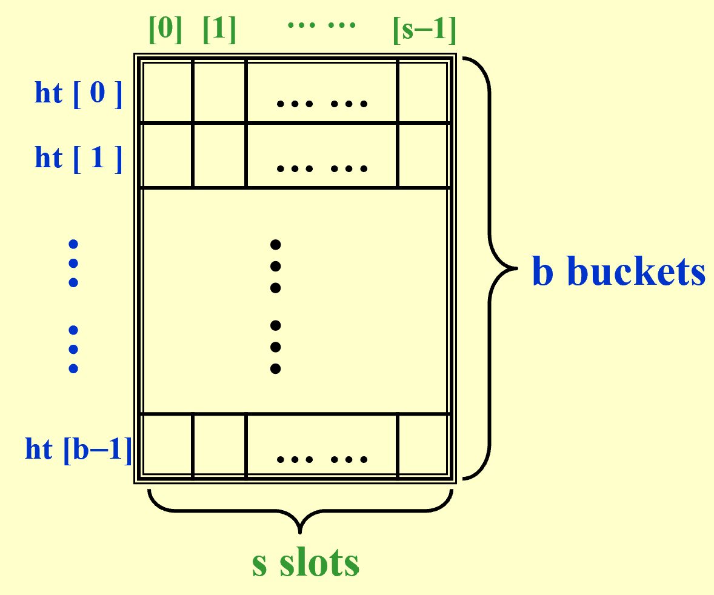

# Hashing

## 1 基本想法

除了基于比较进行排序，然后查找之外，还能通过对应关系查找。我们提出一种简单表结构 symbol table ，类似字典，有唯一名称和对应的属性。比较重要的操作是查找属性、插入、删除。

### 哈希表 Hash Table

对于每一个标识符 identifier $x$ ，定义哈希函数 hash function 为 $f(x)$ ，输出 $x$ 在哈希表中的位置，即哪一个桶中。 

为了评估哈希表的效果，我们记 $T$ 为标识符的总数，$n$ 为已放入哈希表中的标识符总数，给出两个指标：

- 标识符密度 identifier density $\frac{n}{T}$ ；

- 加载密度 loading density $\lambda = \frac{n}{s \cdot b}$ 。

在将标识符放入哈希表的过程中，会遇到两种特殊情况：

- collision 当两个不同的标识符放入同一个桶中，即哈希函数输出相同；

- overflow 当一个标识符被放入已满的桶中。

不难发现，如果没有 overflow ，那么哈希表满足 $T_{serch} = T_{insert} = T_{delete} = O(1)$ 。

## 2 哈希函数 Hash Function

我们希望好的 $f(x)$ 具有性质：

- 容易计算并且使得 collision 出现的情况尽量少；

- 分布均匀，映射到每个桶的概率尽量相等，即 $P(f(x)=i) = \frac{1}{b}$ ；
    - 这种均匀的哈希函数一般称为 uniform hash function 。

!!! example "如何取哈希函数"

    例如，如果 $f(x) = x \% \text{TableSize}$ ，那么 TableSize 取质数最好。

### Seperate Chaining

把哈希值（即位置）一样的标识符放入一个链表中。

### Open Addressing

遇到 collision 情况时，寻找下一个空位来放入标识符。通过冲突解决函数来探测空位。

## 3 Open Addressing

注意，我们接下来讨论的情况都针对哈希表的每个位置只有一个空格，只能放一个标识符。

### Linear Probing

线性探测使用线性函数 $f(i) = i$ 。

容易导致 primary clustering ，在哈希表中形成区块，使得分布不均匀。

### Quadratic Probing

二次探测使用二次函数 $f(i) = i^2$ 。

!!! note "定理"

    使用二次探测时，如果 table size 是质数，并且哈希表至少有一半空位，那么一个新元素一定能放入。

如果有很多插入、删除操作，那么插入的效率会大大下降；另外虽然这解决了线性探测的区块问题，但是会导致 secondary clustering 。

### Double Hashing

使用第二个哈希函数来探测 $f(i) = i \cdot \text{hash}_2(c)$ ，其中 $\text{hash}_2(x) \neq 0$ ，并且要确保所有位置能被探测到。

!!! example "一个好的 $\text{hash}_2(x)$"

    $\text{hash}_2(x) = R - x \% R$ ，其中 $R$ 取一个比 table size 略小的质数。

### Robin Hood Hashing

定义探测举例为当前位置 $c(x)$ 与原本哈希值 $h(x)$ 的间隔，即

$$
d(x) = [c(x) - h(x) + \text{TableSize}] \% \text{TableSize}
$$

探测距离越小，那么这个标识符越富有。

依次插入标识符时，如果新标识符的探测距离大于当前位置上标识符的探测距离，那么把新标识符放到这个位置，替换出来的原标识符继续向后探测。

## 4 Rehashing

在二次探测中，当哈希表超过一半都有元素时，插入可能失败，这时可以进行 rehashing ，基本思路是：

1. 建立新的哈希表，要求 table size 是一个质数，并且至少是原表两倍大；

2. 扫描原来的哈希表，找出没有被删除的元素；

3. 设计新的哈希函数，把找出来的元素插入新的哈希表。

