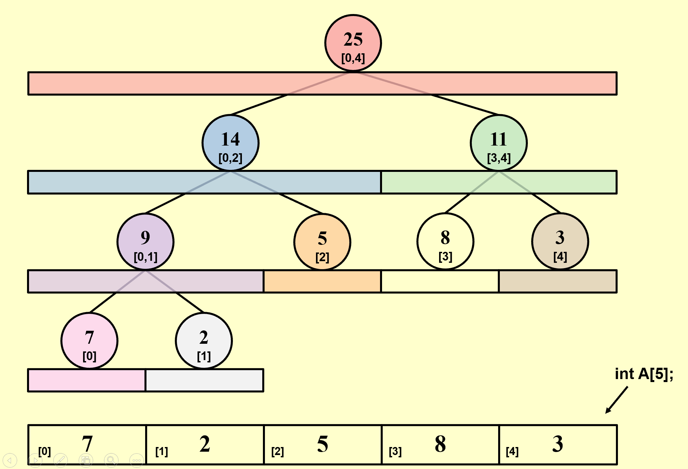

# The Segment Tree

## 1 动机

举例：给出一个数组 $A[1000000]$ ，我们需要频繁地计算任意区间 $[L, R]$ 内的数字之和。

??? code "代码实现"

    ```c
    ElementType  Query ( ElementType A[ ],  int L, int R ) 
    { 
        ElementType sum = 0;    
        for  ( int i = L; i <= R; ++i )
            sum += A[i];
        return sum;
    } 
    ```
    但是这个方法的时间复杂度为 $O(N)$ ，效率太低。


## 2 线段树的结构

线段树是一棵完全二叉树，每个节点代表一个连续区间，存储该区间内所有元素之和。



实际上，从数组 A 到线段树数组 Tree 的映射，是基于完全二叉树父节点和孩子节点索引的性质。当 A 长度固定之后，Tree 的结构和节点对应 A 的区间就完全确定了，变化的是区间中具体某个值或者节点记录的信息类型。

| Tree 中的节点 | Tree 中的索引（从 1 开始） | A 中的区间 $(start, end)$ |
|---|---|---|
| 父节点 | $i$ | $(L, R)$ |
| 左孩子 | $2i$ | $(L, (L + R) / 2)$ |
| 右孩子 | $2i + 1$ | $((L + R) / 2 + 1, R)$ |

## 3 线段树的操作

### 构建 

输入一个数组，采用递归分治的思想构建线段树，存储在另一个数组中
 - 递归终止条件：如果区间长度为 1 ，即遇到叶子节点，存储对应值
 - 划分区间：找到数组中间位置，分成两个区间
 - 构建子树：左子树和右子树
 - 合并：父节点的值为左、右孩子的值之和

>由于线段树是完全二叉树，根节点和孩子节点的索引有规律，可以方便地用数组存储；一般是按照层序遍历的顺序将对应区间之和存进数组，而区间头尾在数组 A 中的索引一般动态计算、不用存储。

??? code "代码实现"

    ```c
    // 传入当前线段树节点 node ，以及它对应的区间头尾在数组 A 中的索引 start 和 end
    void Build ( int node, int start, int end )
    {
        // Base Case: Leaf Node
        if ( start == end ) {
            tree[ node ] = A[ start ];
            return;
        }
    
        // Recursive Step: Split and Build Children
        int mid = ( start + end ) / 2;
        Build ( 2 * node, start, mid );     // 构建左子树
        Build ( 2 * node + 1, mid + 1, end );   // 构建右子树
    
        // Merge Logic: Sum of children
        tree[ node ] = tree[ 2 * node ] + tree[ 2 * node + 1 ];
    }
    ```
    这个方法的时间复杂度为 $O(N)$ ，但是每个节点之被访问一次。


### 区间查询

线段树把原来的数组分成了若干个已经计算好和的小区间，那么查询会区间存在三种情况：
 - 查询区间和这个小区间没有交集，不取小区间的值
 - 查询区间包含这个小区间，取整个小区间的值
 - 查询区间与这个小区间相交或被这个小区间真包含，取部分小区间的值

??? code "代码实现"

    ```c
    int Query ( int node, int start, int end, int L, int R )
    {
        // Case 1: No Overlap (Node is completely outside query range)
        if ( R < start || end < L ) {
            return 0;
        }
    
        // Case 2: Total Overlap (Node is completely inside query range)
        if ( L <= start && end <= R ) {
            return tree[ node ];
        }
    
        // Case 3: Partial Overlap (We need to go deeper into both children)
        int mid = ( start + end ) / 2;
        int left_sum = Query ( 2 * node, start, mid, L, R );
        int right_sum = Query ( 2 * node + 1, mid + 1, end, L, R );
    
        return left_sum + right_sum;
    }
    ```

    这个方法的时间复杂度为 $O(\log(N))$ 。

### 数组更新

数组中某个值发生变化，例如 $A[idx]$ 改变，线段树需要更新的是从这个节点到根节点这条路径上全部的节点值。

??? code "代码实现"

    ```c
    void Update ( int node, int start, int end, int idx, int val )
    {
        // Base Case: Leaf Node found
        if ( start == end ) {
            tree[ node ] = val;
            return;
        }
    
        // Recursive Step: Go left or right depending on where “idx” is
        int mid = (start + end) / 2;
        if ( start <= idx && idx <= mid ) {
            // Index is in the left child
            Update ( 2 * node, start, mid, idx, val );
        } else {
            // Index is in the right child
            Update ( 2 * node + 1, mid + 1, end, idx, val );
        }
    
        // Backtracking Step: Update current node based on new children values
        tree[ node ] = tree[ 2 * node ] + tree[ 2 * node + 1 ];
    }
    ```

    这个方法的时间复杂度为 $O(\log(N))$ 。


## 4 补充

线段树不仅可以求区间和，还可以用于任何满足结合律的聚合算子，例如求最小值、最大值、最大公约数等，只要把节点记录的信息相应替换即可。