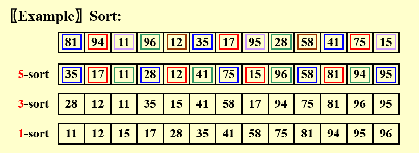
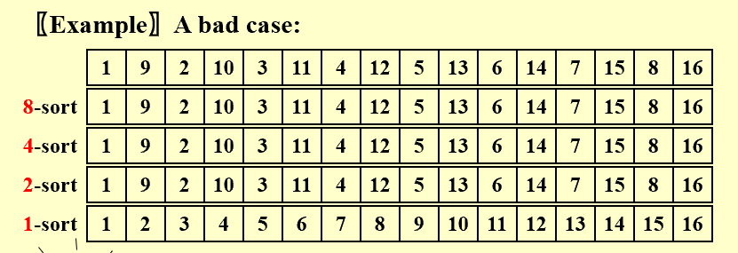
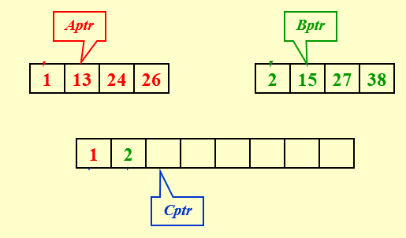
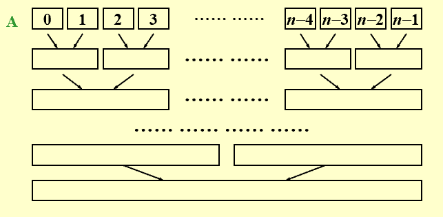

# Sorting

## 0 Preliminaries

- 假定处理的都是整数数组。

- 算法都是基于比较的排序。

- 整个排序过程都在主内存中完成。

## 1 插入排序 Insertion Sort

基本思路是，每次都把一个待排序的数和排好序的数组进行比较，找到位置后插入，代码实现如下

```c
void InsertionSort ( ElementType A[ ], int N ) 
{ 
      int  j, P; 
      ElementType  Tmp; 

      for ( P = 1; P < N; P++ ) { 
    Tmp = A[ P ];  /* the next coming card */
    for ( j = P; j > 0 && A[ j - 1 ] > Tmp; j-- ) 
          A[ j ] = A[ j - 1 ]; 
          /* shift sorted cards to provide a position 
                       for the new coming card */
    A[ j ] = Tmp;  /* place the new card at the proper position */
      }  /* end for-P-loop */
}
```

这种方法，最坏情况的时间复杂度为 $O(N^2)$ ，最好情况的时间复杂度为 $O(N)$ 。

## 2 简单排序算法的下界

逆序对 Inversion 指数组中的两个数不满足要求的排序方式。例如，数组 `[34, 8, 64, 51, 32, 21]` 有 9 个逆序对。

每次交换相邻的两个数，只能消除一个逆序对；因此，任何基于交换相邻元素的排序算法，都有 $O(N^2)$ 级别的时间复杂度。

>更好的办法是，进行更大跨度的交换，每次消除多个逆序对。


## 3 希尔排序 Shell Sort

根据以上讨论，希尔排序在插入排序的基础上，希望更高效地消除逆序对。基本思路是：

 1. 定义增量序列 $h_1 < h_2 < \cdots < h_t$ ，并且 $h_1 = 1$ ；

 2. 从序列最大的一端开始，每次进行以 $h_k$ 为间隔的排序，即 $k = t, t-1, \cdots, 1$ 。

!!! example "例子"

      

一个重要性质是，经过 $h_k$ 排序后，再继续排序，并不会影响 $h_k$ 阶的有序性。

!!! code "代码实现"

      对于长度为 $N$ 的数组，一般取：

      $$h_t = [N / 2], \quad h_k = [h_k / 2].$$

      ```c
      void Shellsort( ElementType A[ ], int N ) 
      { 
            int  i, j, Increment; 
            ElementType  Tmp; 
            for ( Increment = N / 2; Increment > 0; Increment /= 2 )  
                  /*h sequence */
                  for ( i = Increment; i < N; i++ ) { /* insertion sort */
                        Tmp = A[ i ]; 
                        for ( j = i; j >= Increment; j - = Increment ) 
                              if( Tmp < A[ j - Increment ] ) 
                                    A[ j ] = A[ j - Increment ]; 
                              else 
                                    break; 
                        A[ j ] = Tmp; 
                  } /* end for-I and for-Increment loops */
      }
      ```

希尔排序非常适合处理中等规模的数据（几万条级别）。

### 最坏情况分析

希尔排序最坏情况下的时间复杂度为 $\Theta(N^2)$ ，例如



注意到，上面的情况增量序列为 8，4，2，1 其中 8、4、2 都有公约数 2 ，即增量之间不互质，这导致多个增量效果被削弱。

### 改进最坏情况

对于增量序列需要更好的选择，我们引入 Hibbard's Increment Sequence ，它规定

$$h_k = 2^k - 1，$$

确保相邻增量之间没有公因子。这是一个固定的增量序列，实际排序的时候，我们找到其中第一个小于待排序数组规模的值作为初始增量。

Hibbard 增量序列能把希尔排序最坏情况的时间复杂度提升至 $\Theta(N^{\frac{3}{2}})$ 。

另外，Sedgewick 提出了更复杂的增量序列 1，5，19，41，109 ··· ，能把最坏情况的时间复杂度提升至 $O(N^{\frac{4}{3}})$ 。


## 4 堆排序 Heap Sort

>堆排序可以看成选择排序的改进。

最简单的堆排序就是把原数组变成最小堆，每次取出根节点的值放入新数组

```c
{
    BuildHeap( H );             /* O( N ) */
    for ( i=0; i<N; i++ )
        TmpH[ i ] = DeleteMin( H );   /* O( log N ) */
    for ( i=0; i<N; i++ )
        H[ i ] = TmpH[ i ];     /* O( 1 ) */
}
```

时间复杂度 $T(N) = O(N \log{N})$ ，表现很好；因为取出的节点需要存储位置，空间需求翻倍了，不太好。

考虑对上面这个算法进行空间优化：由于每次取出最小堆根节点的元素后，需要将堆中最后一个元素放到根节点处；这会空出一个位置，可以把取出的值放进去；最后得到的是一个降序序列。

如果想要一个升序排序的序列，改成建立最大堆就可以。

!!! code "代码实现"

      ```c
      void Heapsort( ElementType A[ ], int N ) 
      { 
            int i; 

            for ( i = N / 2; i >= 0; i-- ) /* BuildHeap */
                  PercDown( A, i, N ); 
                  
            for ( i = N - 1; i > 0; i-- ) { 
                  Swap( &A[ 0 ], &A[ i ] ); /* DeleteMax */
                  PercDown( A, 0, i ); 
            } 
      }
      ```

对于规模为 $N$ 的数组进行堆排序，平均时间复杂度为 $\Theta(N \log{N})$ ，但是实际应用中通常比使用 Sedgewick 增量序列的希尔排序慢一点。


## 5 归并排序 Merge Sort

### 合并两个有序列表

先考虑一个问题：如何快速合并两个升序的列表？



如上图，两个有序列表分别用指针 `Aptr` 和 `Bptr` 标记当前待合并元素，指针 `Cptr` 则标记新序列当前待填入位置。

每次只要比较 `Aptr` 与 `Bptr` 指向元素的大小，把小的放入 `Cptr` 的位置，直到某个序列遍历完，有序放入另一个序列剩下的元素即可。

这个方法，每个元素被操作一次，时间复杂度为 $O(N)$ ，其中 $N$ 是两个有序序列的总规模。

### 归并排序的实现

参考以上合并两个有序列表的方法，我们对数组进行排列时，考虑将一个区间分为左右两半排序，然后合并。

使用递归的方式，当序列只有一个元素时说明有序，整个思路表示为

```c
void MSort( ElementType A[ ], ElementType TmpArray[ ], 
            int Left, int Right ) 
{   int  Center; 
    if ( Left < Right ) {  /* if there are elements to be sorted */
      Center = ( Left + Right ) / 2; 
      MSort( A, TmpArray, Left, Center ); 	/* T( N / 2 ) */
      MSort( A, TmpArray, Center + 1, Right ); 	/* T( N / 2 ) */
      Merge( A, TmpArray, Left, Center + 1, Right );  /* O( N ) */
    } 
} 

void Mergesort( ElementType A[ ], int N ) 
{   ElementType  *TmpArray;  /* need O(N) extra space */
    TmpArray = malloc( N * sizeof( ElementType ) ); 
    
    if ( TmpArray != NULL ) { 
      MSort( A, TmpArray, 0, N - 1 ); 
      free( TmpArray ); 
    } 
    else  FatalError( "No space for tmp array!!!" ); 
}
```

??? code "代码实现"

      ```c
      /* Lpos = start of left half, Rpos = start of right half */ 
      void Merge( ElementType A[ ], ElementType TmpArray[ ], 
                   int Lpos, int Rpos, int RightEnd ) 
      {   int  i, LeftEnd, NumElements, TmpPos; 
          LeftEnd = Rpos - 1; 
          TmpPos = Lpos; 
          NumElements = RightEnd - Lpos + 1; 
          
          while( Lpos <= LeftEnd && Rpos <= RightEnd ) /* main loop */ 
              if ( A[ Lpos ] <= A[ Rpos ] ) 
                  TmpArray[ TmpPos++ ] = A[ Lpos++ ]; 
              else 
                  TmpArray[ TmpPos++ ] = A[ Rpos++ ]; 
          
          while( Lpos <= LeftEnd ) /* Copy rest of first half */ 
              TmpArray[ TmpPos++ ] = A[ Lpos++ ]; 
          
          while( Rpos <= RightEnd ) /* Copy rest of second half */ 
              TmpArray[ TmpPos++ ] = A[ Rpos++ ]; 
          
          for( i = 0; i < NumElements; i++, RightEnd - - ) 
               /* Copy TmpArray back */ 
              A[ RightEnd ] = TmpArray[ RightEnd ]; 
      }
      ```

如果考虑非递归方式，则自底向上



### 分析

推导归并排序的时间复杂度，我们知道

$$T(1) = 1$$

$$T(N) = 2 T(\frac{N}{2}) + O(N)，$$

因此 $T(N) = O(N + N \log{N})$ 。

归并排序需要线性的额外内存空间 $O(N)$ ，而且内存中复制数组较慢；因此，一般不用于内存排序，而是常用于外存排序。

## Stable & In-place

为了帮助评价排序算法，我们提出两个概念：
 
 - Stable 如果有多个值相同的元素，在排序前后的相对位置不变，那么这个排序算法称为 stable ；

 - In-place 如果这个排序算法不需要额外存储空间（仅需要几个临时变量或指针不算），那么称为 in-place 。

|     | Stable | In-place |
| --- | --- | --- |
| Insert | ✔️ | ✔️ |
| Shell | ❌ | ✔️ |
| Heap | ❌ | ✔️ |
| Merge | ✔️ | ❌ |


## 6 快速排序 Quick Sort

### 思路

采用递归分治的办法，对于每次得到的一个数组，选出一个枢纽 pivot ，把该数组分为小于自身和大于自身的两个不相交子集，然后继续处理这两个数组，以此类推。

表示为伪代码：
```c
void Quicksort ( ElementType A[ ], int N )
{
      // 元素个数小于2 无需排序，直接返回
      if ( N < 2 ) return;      
    
      // 在数组 A 中任意挑选一个元素
      pivot = pick any element in A[ ];     
    
      // 将去掉 pivot 后的数组划分为两个互不相交的子集
      Partition S = { A[ ] \ pivot } into two disjoint sets:  
            A1 = { a ∈ S | a ≤ pivot }
            A2 = { a ∈ S | a ≥ pivot }
    
      // 最终结果 = 对 A1 进行快排拼接上 pivot 拼接上对 A2 进行快排
      A = Quicksort ( A1, N1) ∪ { pivot } ∪ Quicksort ( A2, N2);    
}
```

!!! hint "性质"

      pivot 位置一旦确定，就不会再改变。

最好的情况下，这个算法的时间复杂度为 $T(N) = O(N \log{N})$ 。

### 选择 Pivot

Pivot 的选择直接关系到快速排序的效率，下面给出一些策略。

1. 一种错误的方法是 `Pivot = A[0]` ；
      
      - 最坏的情况下，输入 `A` 已经有序，那么快速排序将花费 `O(N)` 的时间但是没有实质性工作。

2. 一种安全的方法是随机选择 `Pivot` ；

      - 缺点是生成随机数很耗费计算资源，系统开销大。

3. 更好的办法是 Median-of-Three Partitioning ，即 `Pivot = median(left, center, right)` ；

      - 选择数组最左端、中间、最右端的中位数，能消除输入有序导致的最坏情况，实际运行效率也比较高。

### 分区 Partitioning

选定 pivot 之后，一般采用双指针法进行分区。基本思路是由两个指针从数组两端出发向中间移动：

 - 左指针从左往右走，遇到比 pivot 大的元素停下，

 - 右指针从右往左走，遇到比 pivot 小的元素停下，  

 - 两个指针都停下时，互相交换，然后继续走，重复上述逻辑直到相遇。 

!!! warning "极端情况"

      这样分区，当输入数组所有元素相等时，一端的指针会一直走完数组，导致两个子集极度不平衡，时间复杂度达到 $O(N^2)$ 。

      因此，规定指针遇到等于 pivot 的元素时也停下做交换，这样能保证平衡划分。

### 处理小数组

实际上，当数组规模很小（例如小于 20 ）时，快速排序甚至比插入排序更慢。

解决办法是当目前待处理的数组规模很小时，不用快速排序，而是采用其他对小数组更高效的排序。

### 综合实现

!!! code "代码实现"

      ```c
      // 入口函数
      void  Quicksort( ElementType A[ ], int N ) 
      { 
            Qsort( A, 0, N - 1 ); 
            /* A: 	数组 	*/
            /* 0: 	左指针 */
            /* N – 1:   右指针 */
      }


      /* 找到 pivot 并将需要划分的元素拼成连续的一段 */ 
      ElementType Median3( ElementType A[ ], int Left, int Right ) 
      { 
            int  Center = ( Left + Right ) / 2; 
          
            if ( A[ Left ] > A[ Center ] ) 
                  Swap( &A[ Left ], &A[ Center ] ); 
            if ( A[ Left ] > A[ Right ] ) 
                  Swap( &A[ Left ], &A[ Right ] ); 
            if ( A[ Center ] > A[ Right ] ) 
                  Swap( &A[ Center ], &A[ Right ] ); 
            /* 确保 A[ Left ] <= A[ Center ] <= A[ Right ] */ 
          
            Swap( &A[ Center ], &A[ Right - 1 ] ); 
            /* 现在只需要划分 A[ Left + 1 ] … A[ Right – 2 ] */
          
            return  A[ Right - 1 ];  /* 返回 pivot */ 
      }
      
      void  Qsort( ElementType A[ ], int Left, int Right ) 
      {   
            int  i,  j; 
            ElementType  Pivot; 
            
            if ( Left + Cutoff <= Right ) {  /* 不是小数组 */
                  Pivot = Median3( A, Left, Right );  
                  i = Left;     
                  j = Right – 1;  
                  /* 不用 Left+1 和 Right-2 是为了配合接下来的前缀自增/自减 */
                  
                  for( ; ; ) { 
                        while ( A[ + +i ] < Pivot ) { }  
                        while ( A[ – –j ] > Pivot ) { }  
                        if ( i < j ) 
                              Swap( &A[ i ], &A[ j ] );  
                        else     
                              break;  
                  } 

                  /* 划分结束后左指针 i 就停在 pivot 应该去的位置，因此交换 */ 
                  Swap( &A[ i ], &A[ Right - 1 ] ); 
                  
                  Qsort( A, Left, i - 1 );      /* 排序左边部分数组 */
                  Qsort( A, i + 1, Right );   /* 排序右边部分数组 */
            }  
            else 
                  /* 小数组用插入排序 */ 
                  InsertionSort( A + Left, Right - Left + 1 );
      }
      ```

### 算法分析

快速排序的时间复杂度可以表示为

$$
T(N) = T(i) + T(N - i - 1) + cN ,
$$

即 pivot 左边和右边排序的时间 + 当前层进行分区（双指针扫描整个数组花费线性时间）的时间。

#### 最坏情况

每次分区都极度不平衡，退化为

$$
T(N) = T(N-1) + cN = O(N^2) .
$$

#### 最好情况

每次分区都很平衡

$$
T(N) = 2 T(\frac{N}{2}) + cN = O(N \log{N}) .
$$

#### 平均情况

我们假定 pivot 出现在数组任何一个位置的概率均等，那么对于任意的 $i$ 有

$$
\bar{T}(i) = \frac{1}{N} \sum_{j=0}^{N-1} T(j) ,
$$

代入公式得到

$$
T(N) = [\frac{2}{N} \sum_{j=0}^{N-1} T(j)] + cN = O(N \log{N}) .
$$


??? example "采用快速排序想法的一个小例题"

      >❓️给定一个包含 $N$ 个元素的列表和一个整数 $k$ ，找出其中第 $k$ 大的元素。

      💭利用分区思想，记第一次分区后 pivot 的位置为 $i$ ，只要比较 $i$ 与 $k$ 的大小：

       - 如果相等，则 pivot 就是这个元素；
      
       - 如果 $k < i$ ，则不用管右边，继续排序左边部分数组；
      
       - 如果 $k > i$ ，则不用管左边，继续排序右边部分数组。
      

## 7 大型结构的排序

上述的排序算法都是基于比较和交换的，但是对于大型结构，交换的开销非常大。

解决办法是增加一个指针字段指向结构体，交换时只交换指针而不动结构体本身（indirect sorting）。最后如果需要，再按照指针拍好的序调整结构体顺序。


## 8 排序算法的一般下界

任何只基于元素比较的排序算法，最坏情况下的计算时间复杂度下界必然是 $\Omega(N \log{N})$ 。