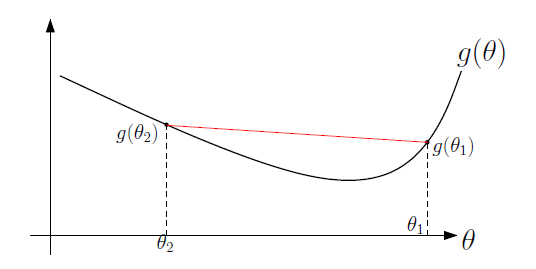

# 基于梯度的凸优化

## 1 Supervised Machine Learning

给出 $n$ 个样本 $(x_i, y_i) \in \mathbf{X} \times \mathbf{Y}$ ，目标是学习一个函数 $\theta^\text{T} \Phi(x)$ ，能够通过特征 $\Phi(x) \in \mathbb{R}^\text{d}$ 来判断标签 $y$ 。

因此，需要经验风险最小化
$$
\min_{\theta \in \mathbb{R}^\text{d}}{\frac{1}{n} \sum_{i=1}^n l(y_i, \theta^\text{T} \Phi(x_i)) + \mu \Omega(\theta)},
$$
- 损失函数 $l$ 有多种形式；

- 正则化项 $\Omega$ 主要是为了防止过拟合。 

## 2 Convexity

### 没有假定可微的情况

如果函数 $g$ 满足
$$
\forall \theta_1, \theta_2, \alpha \in [0, 1]
$$

