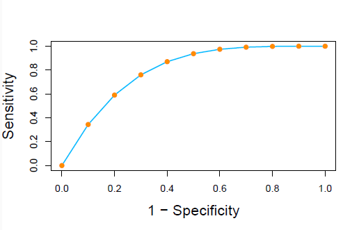

# Logistic Regression and Discriminant Analysis

## 1 逻辑回归

对于一个模型，结果的标签更常见的是概率形式

$$
\eta (x) =  P(Y = 1 | X = x)，
$$

这里我们认为 $Y$ 只有 0 和 1 两种可能，服从伯努利分布。

逻辑回归就是要把 $(- \infty, + \infty)$ 映射到 $[0, 1]$ 范围上，使之以概率的形式表达，一般采用

$$
\log \frac{\eta(x)}{1 - \eta(x)} = x^T \beta , \quad \eta(x) = \frac{\exp{x^T \beta}}{1 + \exp{x^T \beta}}.
$$

### 求解系数

对于现在这个 Logistic 函数 $\eta(x)$ ，我们先写出它的对数似然函数

$$
l \log {L(\beta)} = \sum_{i=1}^n \log{p(y_i | x_i, \beta)},
$$

并转化为

$$
l = \sum_{i=1}^n y_i x_i^T \beta - \log{[1 + \exp{(x_i^T \beta)}]}.
$$

使用牛顿法更新 $\beta$ ，直到最大化似然函数

$$
\beta^{new} = \beta^{old} - [\frac{\partial^2 l(\beta)}{\partial \beta \partial \beta^T}]^{-1} \cdot \frac{\partial l(\beta)}{\partial \beta}\Big|_{\beta^{old}}.
$$

>公式推导待学习

## 2 评价分类模型

### 混淆矩阵

理论上模型的训练结果可以概括为

|         | 观测为真 | 观测为假 |
| -----   | ------- | ------- |
| 预测为真 | TP | FP |
| 预测为假 | FN | TN |

给出三种指标进行评价：

- 准确率 

    $$Overall Accuracy = \frac{TP + TN}{TP + TN + FP + FN}$$

- 灵敏度

    $$Sensitivity = \frac{TP}{TP + FN}$$

- 特异度

    $$Specificity = \frac{TN}{TN + FP}$$

### ROC 曲线

以上方法只能在一个确定的阈值（这里指区分真和假的界线）下使用，但是为了评价阈值变化时的模型表现，我们引入 ROC 曲线

这体现了阈值变化时模型的灵敏度和特异度指标的改变。

这里，曲线下的面积 AUC 越接近 1，说明模型的分类能力越好。

## 3 LDA 和 QDA

？听不懂
